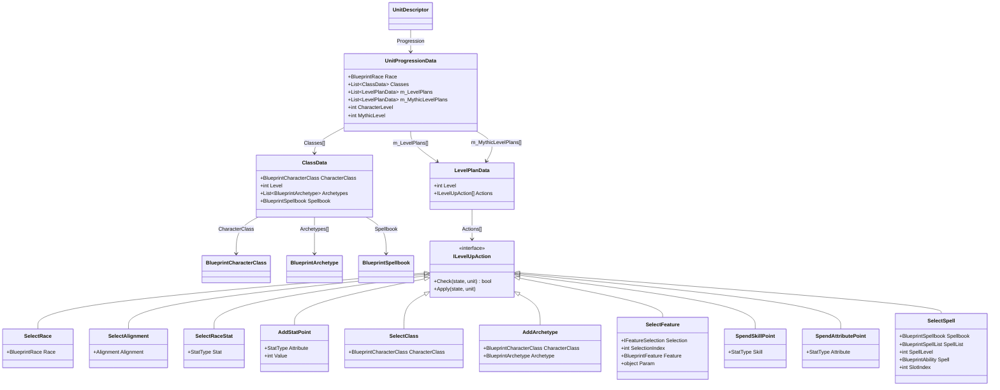

# WoTR 게임 아키텍처 (빌드 관련)

`Assembly-CSharp.dll` 디컴파일 기반. 빌드 import/export에 필요한 클래스만 정리.

---

## 클래스 다이어그램



---

## 레벨업 흐름

`LevelPlanData.Actions[]`에 저장된 액션이 `LevelUpController`에 의해 순서대로 실행된다.

### 레벨 1 (캐릭터 생성)
```
SelectRace → SelectAlignment → AddStatPoint(×6) → SelectRaceStat? → SelectClass → AddArchetype? → SelectFeature(×N) → SpendSkillPoint(×N)
```

### 레벨 2~20
```
SelectClass → AddArchetype? → SelectFeature(×N) → SpendSkillPoint(×N) → SpendAttributePoint?
```
- `SpendAttributePoint`는 캐릭터 레벨 4, 8, 12, 16, 20에만 발생

### 신화 레벨 (m_MythicLevelPlans)
```
SelectClass(신화클래스) → SelectFeature(×N)
```
- 첫 번째 신화 레벨에서만 신화 클래스 선택

---

## 스탯 포인트 배분 (StatsDistribution)

캐릭터 생성 시 25포인트 지급. 모든 스탯 기본값 10.

| 스탯값 | 누적 비용 |
|--------|-----------|
| 7      | -4 (환불) |
| 8      | -2        |
| 9      | -1        |
| 10     | 0         |
| 11     | 1         |
| 12     | 2         |
| 13     | 3         |
| 14     | 5         |
| 15     | 7         |
| 16     | 10        |
| 17     | 13        |
| 18     | 17        |

범위: 최소 7 ~ 최대 18 (포인트 충분 시)

---

## 스킬 관련

- 스킬은 Blueprint GUID가 없고 `StatType` enum으로 식별
- 주요 StatType 예시: `SkillAthletics`, `SkillMobility`, `SkillThievery`, `SkillStealth`, `SkillKnowledgeArcana`, `SkillKnowledgeWorld`, `SkillLoreNature`, `SkillLoreReligion`, `SkillPerception`, `SkillPersuasion`, `SkillUseMagicDevice`
- 레벨당 스킬 랭크 상한: 해당 캐릭터 레벨 (같은 스킬에 레벨당 최대 1랭크)

---

## Pure JSON ↔ 게임 매핑 요약

| Pure JSON 필드 | 게임 액션/클래스 |
|---|---|
| `RaceGuid` | `SelectRace.Race` GUID |
| `Alignment` | `SelectAlignment.Alignment` enum 이름 |
| `RaceStatBonus` | `SelectRaceStat.Stat` StatType 이름 |
| `BaseAbilityScores` | `AddStatPoint` 결과 (`StatsDistribution.StatValues`) |
| `LevelEntry.ClassGuid` | `SelectClass.CharacterClass` GUID |
| `LevelEntry.ArchetypeGuids` | `AddArchetype.Archetype` GUID (복수 가능) |
| `LevelEntry.Selections` | `SelectFeature` 액션들 |
| `LevelEntry.SkillRanks` | `SpendSkillPoint` 액션들 (StatType → 횟수) |
| `LevelEntry.AttributeIncrease` | `SpendAttributePoint.Attribute` StatType 이름 |
| `LevelEntry.Spells` | `SelectSpell` 액션들 |
